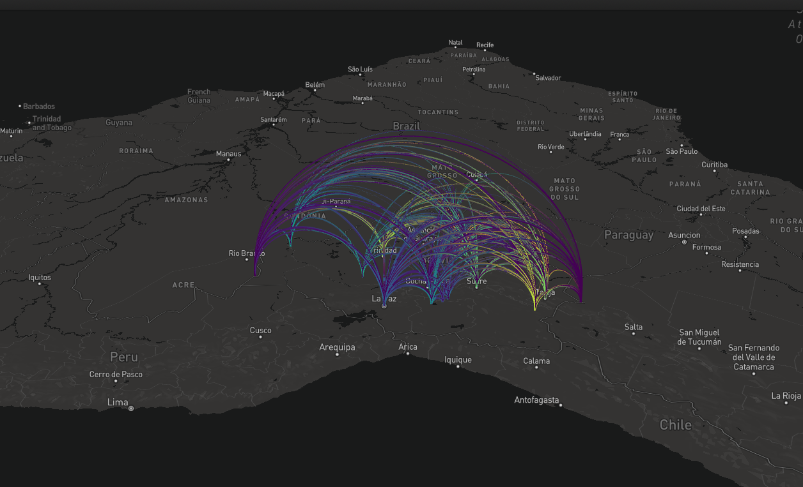

# Geospatial Data Analysis and Visualization Course

The course focuses on cleaning, visualizing, and interacting with geospatial data using R. It was delivered in July 2024 as part of my visiting scholar position at the ePC business school in the the Universidad Católica Boliviana "San Pablo". 

If you want to create the interactive map using `mapdeck`, please remember to [sign up for a Mapbox account here](https://account.mapbox.com/auth/signup/?route-to=%22https%3A%2F%2Faccount.mapbox.com%2F%22).

Once you have that, you can copy and paste your account's standard API token into the R environment when you get to part 3 of the class. 

## Course Outline

### Part 1: Introduction to Interacting with APIs
- **Objective**: Learn how to make API calls and visualize geospatial data using R.
- **Tools**: `sf`, `raster`, `dplyr`, `RNaturalEarth`, `ggplot2`
- **Outcome**: A basic visualization of a World Bank API call.

### Part 2: Cleaning and Visualization Difficult Subnational Government Data
- **Objective**: Understand techniques to clean, merge, and visualize subnational data
- **Tools**: `ggplot2`, `sf`, `dplyr`, `janitor`, 
- **Outcome**: A subnational map of Bolivia showing a selected literacy indicator.

### Part 3: Reshape Awkard Data to Build an Interactive Maps with `mapdeck`
- **Objective**: Reshape data to design interactive maps using the `mapdeck` package.
- **Tools**: `mapdeck`, `dplyr`
- **Outcome**: An arc map showing migration flows within Bolivia.

## Key Learning Points
- Interacting with APIs to retrieve geospatial data.
- Using various R packages to clean, reshape, and visualize data.
- Designing interactive maps to present data insights effectively.

## Maps Created
1. **Cleaned Geospatial Data Map**: Demonstrates data cleaning techniques.
2. **Static Subnational Map**: Uses `ggplot2` to visualize indicators at a subnational level.
3. **Interactive Arc Map**: Employs `mapdeck` to create dynamic visualizations of migration flows.

## Tools and Packages
- `sf`: For handling geospatial data.
- `raster`: For raster data manipulation.
- `dplyr`: For data manipulation.
- `ggplot2`: For static data visualization.
- `mapdeck`: For interactive maps.
- `RNaturalEarth`: For merging data.
